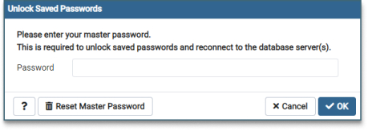

# Database Bootcamp 2021

## Competencies, Behaviours and Knowledge units

These relate to the KSBs defined in the [Level 4 Software Developer standard](https://www.instituteforapprenticeships.org/apprenticeship-standards/software-developer-v1-1).

* **K10**: principles and uses of relational and non-relational databases
* **S3**: link code to data sets

---
## Table of contents
---
- [Project Slides](#project-slides)
- [Overview](#overview)
- [Screenshot](#screenshot)
---
- [What you can expect](#what-you-can-expect)
	- [Day 1](#day-1)
	- [Day 2](#day-2)
	- [Timing and Breaks](#timing-and-breaks)
	- [General Advice for the Bootcamp](#general-advice-for-the-bootcamp)
---
- [Essential Tools](#essential-tools)
- [Optional Tools](#optional-tools)
---
- [Installing the Database and Website Services](#installing-the-database-and-website-services)
	- [1. Clone the Repository Locally](#clone-the-repository-locally)
	- [2. Docker Compose](#docker-compose)
---
- [Software and Extensions Used](#software-and-extensions-used)
	- [Front-End](#front-end)
	- [Back-End](#back-end)
	- [Installing PostgreSQL Locally](#installing-postgresql-locally)
---
- [Useful resources](#useful-resources)
- [Author](#author)
- [Acknowledgments](#acknowledgments)
---

&nbsp;

# Project Slides
- The full slide deck for the project is [available from the following link](https://mcr-digital.github.io/apprentice-boot-camp-databases/public/slides/slide_000/)

---

# Overview
- A sample database back-end, based on a fictional retail company  called `Sequel-Mart`.
- A basic front-end using vanilla HTML, CSS & Javascript with Express.
- This project aims to show how a basic database-driven relationship to a back-end web server could be managed.

---

# Screenshot

Completed Sequel-Mart project web page:


&nbsp;

---
# What you can expect

## Day 1
### Section 1 (What are databases?)
- Introduction & [Set-up via Github and Docker]((#installing-the-database-and-website-services)).
	+ If you can complete the setup beforehand, that will help us make a prompt start to the boot-camp 
- How databases fit into a front-end / back-end architecture
- Fundamental concepts of databases (Data Types, ERDs)
- Introduction to PostgreSQL's interface

### Section 2 (Querying a relational database - **CR**UD)
- Read (`SELECT` `FROM`, `WHERE`, `LIMIT`, `ORDER BY`, `GROUP BY`, `HAVING`)
- Joining (`INNER JOIN`, `LEFT OUTER JOIN`)

### Section 3 (Changing content in a relational database - CR**UD**)
- Create (`CREATE TABLE`)
- Update (`INSERT`, `UPDATE`)
- Delete (`DELETE`, `TRUNCATE`, `DROP`)
- Changing column details (`ALTER ...`)

---
## Day 2

### Section 4 (Streamlining - making a relational database more efficient)
- System Tables
- Speeding up queries
- `CREATE INDEX`, `CREATE VIEW`, `CREATE PROCEDURE`, Transactions
- SQL Injection

### Section 5 (Sequel-Mart)
- Project structure
- Routing

### Section 6 (Exercises)
- Creating queries to populate the following routes:
	- Transaction *(most recent 10)*
	- Customers *(top 10 by average spend)*
	- Products *(top 10 by items sold)*
	- Summary *(6x headline cards at the top of the example web-page)*

---
## Timing and Breaks
- Morning = 09:30am - 12:30pm
- Lunch		= 12:30pm - 1:30pm
- Afternoon = 1:30pm - 4:30pm

Trying to absorb a lot of information in a short time can be exhausting. We will be aiming for 45 minutes of work followed by 15 minute breaks.

Get away from the monitor and take a real break. Pairing or not, taking breaks is important and increases productivity.

&nbsp;

---
## General Advice for the Bootcamp

### Breakout rooms
There is no better way to learn a craft than to get stuck in and practice, practice, practice!  Collaborating and bouncing ideas off each other helps too.

The first section is all theory but after that there will be regular sets of exercises.  These exercises are an opportunity to split into groups, try to answer them, then come back together to fill in any gaps in our knowledge.

### Camera Always On If Working Remotely

Working face-to-face is powerful because we communicate with the whole body, not just our words. And we are much more attentive because any distraction like looking at the smartphone during a discussion will be detected immediately.

So would advise activate our cameras all the time.

### Whiteboard

In the absence of physical collaboration on a whiteboard, a tool like [Miro](https://miro.com/) is a reasonable alternaive. You can share the Miro board in a video conference, so that everyone puts their focus on the same section of the board.

&nbsp;

---
# Essential Tools
- A [GitHub account](https://github.com)
- A code editor (e.g. [VS Code](https://code.visualstudio.com/download))
- Docker Desktop on [Windows](https://docs.docker.com/desktop/windows/install/) or [Mac](https://docs.docker.com/desktop/mac/install/)
	+ This is needed to be able to [access the project files and slides](#docker-compose)
	- You may need to [install an update to the Linux Kernal package](https://docs.microsoft.com/en-us/windows/wsl/install-manual#step-4---download-the-linux-kernel-update-package) if prompted
- Slack on [Windows](https://slack.com/intl/en-gb/downloads/windows) or [Mac](https://slack.com/intl/en-gb/downloads/mac)
	+ This will enable you to collaborate with other students and mentors on the channel set up for the bootcamp


## Optional Tools

- [Zoom](https://zoom.us/download)
	+ If you are taking this bootcamp remotely you will need to be able to access the session live via our Zoom meeting link (provided separately)

&nbsp;

---
# Installing the Database and Website Services
This section contains a step-by-step guide to installing everything you need to successfully complete the exercises in this boot-camp.

These instructions are also available in the [Slide deck - Setting up the Project](https://mcr-digital.github.io/apprentice-boot-camp-databases/public/slides/slide_005/)
&nbsp;

## Clone the Repository Locally
### 1.0 Clone the Repository

- Create a folder anywhere on one of your local hard-drives
- Open your preferred code editor and run
```
git clone https://github.com/MCR-Digital/apprentice-boot-camp-databases.git
```
- This will copy the files from the repo above onto your machine.
- Access the root folder
```
cd .\apprentice-boot-camp-databases\
```

## Docker Compose
### 2.0 Docker Services

Three services are defined in `docker-compose.yml`:

1. `database`: 
	- This runs a postgres database
  - Data is persisted between runs
2. `populate-database`
	- This runs another postgres container which is only used to import the data in `/database_backups/sequel-mart-20210919-complete`
  	- This only runs when the `initialise` profile is specified, so that it doesn’t have to run every time (otherwise it would try to recreate the database each time).
3. `app`
	- This runs the application within a node image
  - This requires `npm install` to be run first, as the node modules are copied into the container

### 2.1 First time set up
- Open `Docker Desktop` and make sure it is running before continuing
- If the services listed below are present and running, move on to section 2.2 instead to just restart the services
- Run `./setup.sh` (if using a Mac) or `./setup.bat` (if using Windows)
- This will start the database.  It will then wait five seconds and populate the database

#### Checks ####

##### 2.1.1. `Docker Desktop`
This should now contain the following containers / apps:
- apprentice-boot-camp-databases (RUNNING)
	- apprentice-boot-camp-databases-database-1 `postgres` (RUNNING)
	- apprentice-boot-camp-databases-app-1 `node:8` (RUNNING)
	- pgadmin4_container `dpage/pgadmin4` (RUNNING)
		
##### 2.1.2. Front-end web page
- On a browser tab open [http://localhost:5001/](http://localhost:5001/).
- Confirm that you can see the SQL-Mart web page as per the screenshot above.

##### 2.1.3. PgAdmin 
This is the GUI for the Relational Database Management System (RDBMS) we will be using.
- On a browser tab open [http://localhost:5050/](http://localhost:5050/).
- In PgAdmin, expand the `Servers (1)` folder on the left
- You will be prompted for a password.  The password is `MDigital21`
- You should now be able to expand `Databases > sequel-mart > Schemas`
- There should be 3 schemas
	- **public** - created by Postgress by default.  Not used in this bootcamp.
	- **sequel-mart-schema** - contains the tables used in this bootcamp.
	- **table-load-base** - contains base tables and processes used to populate tables in the `sequel-mart-schema` schema above.

Once all the checks are complete use `ctrl c` or `cmd c` to stop docker.

### 2.2 Running the app

- Run `./run.sh` (Mac) or `./run.bat` (Windows)
	- This will pull, download and start the database, the application, and pgadmin.
	- This will take about 3-5 minutes to run depending on the specification of your computer.
	- Check the application and PgAdmin pages still connect successfully.

You can stop the services at any time by hitting `ctrl-c`on the terminal session and terminating the batch job if prompted.
Running `./run.sh` or `./run.bat` will restart the service.

### 2.3 Starting over

- Run `./teardown.sh` (Mac) or `./teardown.bat` (Windows)
 - This will delete your data
 - You can now run from  [2.1 First time set up](#2.1-first-time-set-up) again should you want to re-download the project.

### 2.4 Possible Issues
There are a couple of known difficulties with setting this process up.  Where found, possible workarounds are listed below.  Should none of these work please feel free to reach out on the bootcamp Slack channel and/or post an issue to this repository.

#### 2.4.1 Sometimes the database schemas in 2.1.3 don't appear.
This is due to a corruption in the *pgadmin4_container* container on setup.  It causes the database to shut down before the database schemas are created.  If this happens, try the following:
	- Close any terminal sessions with `crtl c` or `cmd c`
	- Open Docker Desktop
	- Mouse over the *apprentice-boot-camp-databases* header container
	- Click the garbage bin icon on the right.  This will delete the container.
	- Re-run the setup process again from [2.1 First time set up](#2.1-first-time-set-up)

&nbsp;

---
# Software and Extensions Used
## Front-End
- HTML5
- CSS
- Javascript
- [node.js 14.5.0 / npm 6.14.5](https://nodejs.org/download/release/v14.5.0/)
- express 4.17.1
- pg-promise 10.11.0
- nodemon 2.0.12

If running locally, (make sure you set up a virtual environment in your project folder) once npm has been installed, run:
```
npm run scripts
```
Refer to `package.json` to see the full list

## Back-End
- [PostgreSQL 13.3](https://www.postgresql.org/download/)

## Installing PostgreSQL Locally
This shouldn't be necessary if you're using Docker but should you want to do this:
- Go to [PostgreSQL's download page](https://www.postgresql.org/download/)
- Download the right install files for your operating system
- Click on the **installer file** (.exe)

Follow the steps to set:
1. A default location for the **Installation Directory**
2. The **components** and **add-ons** required (PostgreSQL Server, pgAdmin 4 & Command Line Tools as a minimum)
3. A default **directory** for the **databases**
4. A **superuser** user and **password** (retype to confirm)
5. A **port number** for the database server to listen (defaults to **5432**)
6. Preview your choices

7. Click *Next* to install PostgreSQL
8. Click *Finish* when it’s done

#### Loading pgAdmin
- Locate the pgAdmin app
- Once it's loaded, input the default password created in step 4 above



---

&nbsp;
# Useful resources

- [Sequel-Mart course](https://github.com/MCR-Digital/apprentice-boot-camp-databases)
- [PostgreSQL v13 Documentation](https://www.postgresql.org/docs/13/index.html)
- [PostgreSQL system tables](https://www.postgresql.org/docs/9.1/catalogs.html)

---

&nbsp;
# Author

[Thomas Steeples (course created while working for Zuto)](https://github.com/Tom-S82/sequel-mart)

---

&nbsp;
# Acknowledgments
- A big thanks to all of the mentors at Manchester Digital who have helped with the final delivery of this course material, and for mentoring the students.
- Thanks also to [Zuto](https://www.zuto.com/) for supporting Manchester Digital, and for allowing me the time to put this course together.
